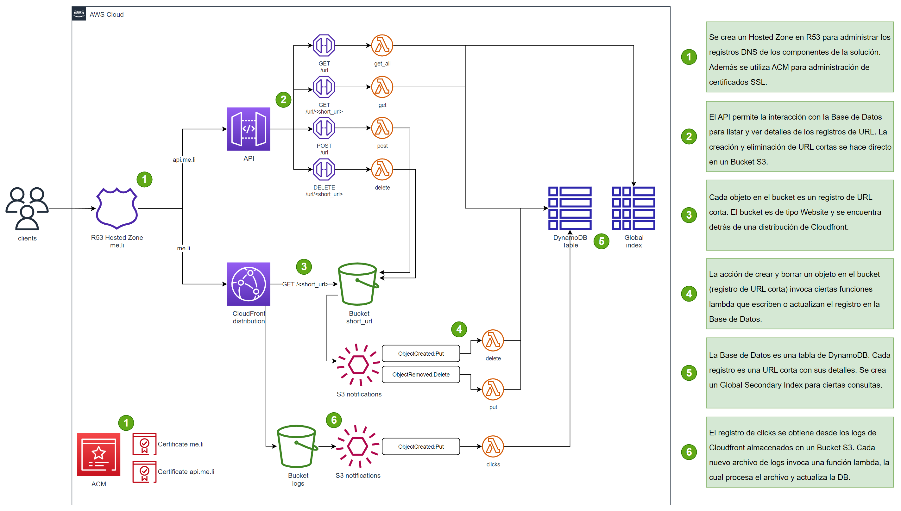
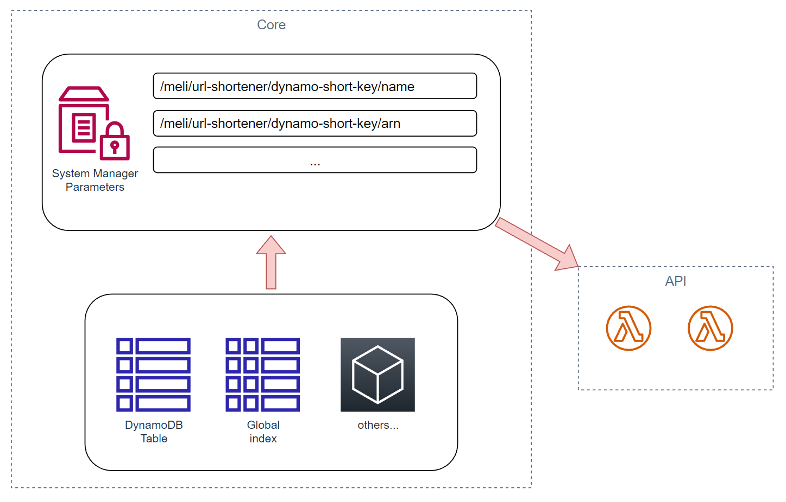

# Proyecto Meli - URL Shortener

URL Shortener es un proyecto que permite crear y usar URL cortas (me.li/AA11BB).

## API Docs
Para una lista de los recursos disponibles y sus endpoint ver [API Doc](2-api/swagger.yml).

## Resumen de la solución
Este proyecto está diseñado en AWS y utiliza servicios como Lambda, API Gateway, S3, CloudFront, etc. Este repositorio contiene el código fuente y los archivos de soporte para una aplicación serverless implementada en AWS.

La siguiente imagen muestra un diagrama simplificado con los recursos y sus interconexiones:

## Detalles de la solución
El proyecto está construido en varias capas o sub-proyectos. Estos sub-proyectos deben ser desplegados en AWS en un orden específico para evitar errores de interdependencia. Cada sub-proyecto está en los siguientes directorios:

- **0-domain:** Proyecto Terraform para crear y administrar recursos referentes al dominio, como el hosted zone en Route53 y certificados en ACM.
- **1-core:** Proyecto Terraform para crear y administrar recursos Core de la solución como la distribución en CloudFront, Tablas en DynamoDB y buckets en S3.
- **2-api:** Proyecto AWS SAM para crear el API.
- **3-events:** Proyecto Terraform para crear y administrar las notificaciones de S3 que vinculan los recursos del Core con el API.

Los distintos sub-proyectos leen o conocen los recursos de los otros sub-proyectos por medio de parámetros de AWS System Manager. Por ejemplo, en el sub-proyecto **1-core** se crea una tabla en DynamoDB, y sus datos relevantes (nombre, ARN, etc.) se guardan como parámetros de AWS System Manager. Por lo tanto, el sub-proyecto **2-api** lee esta información desde dichos parámetros.

### 0 - Domain
Se crea un Hosted Zone de tipo público en Route53, y dos certificados en ACM, uno para el Cloudfront (que redirecciona una URL corta a una URL larga) y otro para el API (que permite administrar los registros de URL).

En este caso, se utilizará el dominio `jml.lat`. Por lo tanto, las redirecciones son del tipo `jml.lat/<SHORTCODE>` y la API estará disponible en `api.jml.lat/url`.

Este proyecto está construido con Terraform, por lo tanto, para desplegar los recursos, simplemente se debe estar ubicado sobre el directorio del proyecto `0-domain` y ejecutar `terraform apply`.

En este sub-proyecto se disponiblizan los siguientes parámetros en AWS System Manager:

- `/meli/url-shortener/domain_main/name`
- `/meli/url-shortener/domain_main/zone_id`
- `/meli/url-shortener/acm_certificate_main/arn`
- `/meli/url-shortener/acm_certificate_api/arn`

### 1 - Core
Se crea un Bucket en S3 con la configuración de Website para almacenar los registros de URL cortas. Cada objeto en el bucket es un registro de URL corta, es un archivo sin tamaño ni formato, con el metadata `x-amz-website-redirect-location` referenciando a la URL larga a redireccionar. Mas info en el [siguiente link](https://docs.aws.amazon.com/AmazonS3/latest/userguide/how-to-page-redirect.html).

El bucket se encuentra detrás de una Distribución de Cloudfront. Esta distribución usa la información de `0-domain` para su configuración. Además se configuran los logs de Cloudfront para que se guarden en otro Bucket de S3 que es creado también en este proyecto. Los logs serán útiles para calcular los clicks o uso de cada URL corta (cuántas veces se usa una URL corta).

También en este sub-proyecto se crea una tabla en DynamoDB con un Global Secondary Index.

Este proyecto está construido con Terraform, por lo tanto, para desplegar los recursos, simplemente se debe estar ubicado sobre el directorio del proyecto `1-core` y ejecutar `terraform apply`.

En este sub-proyecto se disponiblizan los siguientes parámetros en AWS System Manager:

- `/meli/url-shortener/bucket-short-key/name`
- `/meli/url-shortener/bucket-short-key/arn`
- `/meli/url-shortener/bucket-short-key/website-endpoint`
- `/meli/url-shortener/bucket-short-key-cloudfront-logs/name`
- `/meli/url-shortener/bucket-short-key-cloudfront-logs/arn`
- `/meli/url-shortener/dynamo-short-key/name`
- `/meli/url-shortener/dynamo-short-key/arn`
- `/meli/url-shortener/dynamo-short-key/global-index/name`

### 2 - API
Se crea el API con API gateway y varias funciones en AWS Lambda para manejar cada uno de los endpoint disponibles. Además se crean algunas funciones Lambdas que serán necesarias para reaccionar a los eventos de S3.

Este proyecto está construido con AWS SAM, por lo tanto, para desplegar los recursos, simplemente se debe estar ubicado sobre el directorio del proyecto `2-api` y ejecutar `sam deploy --config-env dev --no-fail-on-empty-changeset`.

En este sub-proyecto se disponiblizan los siguientes parámetros en AWS System Manager:

- `/meli/url-shortener/sam-api/lambda/put-item-dynamo/arn`
- `/meli/url-shortener/sam-api/lambda/delete-item-dynamo/arn`
- `/meli/url-shortener/sam-api/lambda/read-cloudfront-logs/arn`

### 3 - Events
Se crean S3 notifications para que ciertas funciones lambdas reacciones a ciertos eventos dentro de los Buckets de S3. En detalle:

- Bucket S3 url-shortener
  - Evento `s3:ObjectCreated:Put` notifica a una función Lambda para crear un nuevo registro en la DB.
  - Evento `s3:ObjectRemoved:Delete` notifica a una función Lambda para editar un registro en la DB.

- Bucket S3 url-shortener-logs
  - Evento `s3:ObjectCreated:Put` notifica a una función Lambda para leer el archivo de logs y actualizar los registros en la DB con la cantidad de accesos detectados en las URL cortas.

Este proyecto está construido con Terraform, por lo tanto, para desplegar los recursos, simplemente se debe estar ubicado sobre el directorio del proyecto `3-events` y ejecutar `terraform apply`.
